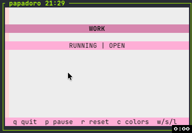

# doro-cli

Tiny terminal pomodoro. Full-screen vibes. Keyboard-first flow. Soft pastel themes. Chiptune cues.

Based on the Pomodoro Technique: https://en.wikipedia.org/wiki/Pomodoro_Technique

## Preview



## Why doro-cli

- fast launch, no config maze
- focused timer flow with zero UI noise
- prompt-based mode switching (safe, explicit)
- mouse click support in switch prompt
- two color schemes (`modern` and `calm`) via `c`
- lightweight generated audio cues (no external media files)

## Quick start

```bash
npm install
npm run build
node dist/cli.js
```

Dev mode:

```bash
npm run dev
```

Optional local command:

```bash
npm link
doro
```

## Controls

- `q` quit
- `p` pause/resume
- `r` reset current timer and run (short beep)
- `c` toggle color scheme (`modern` <-> `calm`)
- `m` mute/unmute all sounds
- `Shift+D` debug: jump current running timer to 3s left
- `w` start work (22 min default)
- `s` start short rest (5 min default)
- `l` start long rest (12 min default)
- `L` lock/unlock hotkeys

## Timer behavior

- long rest every `3` completed work sessions
- at `00:00`: completion beep + 60s switch prompt
- in prompt: `q` exits, any other key or mouse click confirms next mode
- if no confirm in 60s: app auto-switches and starts next mode

## Contributing

New contributor welcome. Keep diffs small. Keep UI readable in common terminals.

```bash
npm run lint:local
npm run typecheck
npm run test:unit
```

If changing colors/audio/controls, add or adjust tests in `src/__tests__`.
