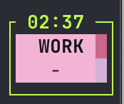
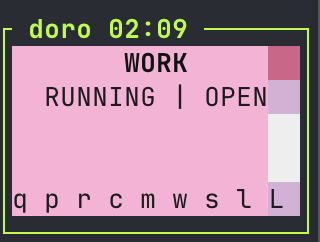
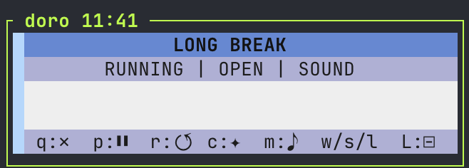
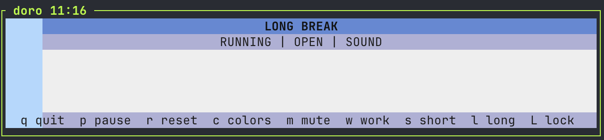

# doro-cli

A minimal, keyboard-first, full-screen terminal Pomodoro timer with soft pastel themes and synthetic 8-bit audio cues.

Focus on your work, not your timer.


## Features

- **Distraction-Free UI**: Full-screen, minimalist design keeps you focused.
- **Keyboard-First**: Navigate and control everything from your keyboard.
- **Responsive Layout**: Adapts to any terminal size, from tiny to wide.
- **Color Themes**: Switch between `modern` and `calm` themes with a keypress.
- **Audio Cues**: Lightweight, generated 8-bit sounds for timer events (no media files needed).
- **Mouse Support**: Optional mouse control for key actions.

### Gallery

|                             Small                              |                               Medium (Text Hints)                               |                                Medium (Icon Hints)                                |                             Wide                             |
| :------------------------------------------------------------: | :-----------------------------------------------------------------------------: | :-------------------------------------------------------------------------------: | :----------------------------------------------------------: |
|  |  |  |  |

## Quick Start

Requires Node.js >= 22.

```bash
# Clone the repository
git clone https://github.com/dnim/doro-cli.git
cd doro-cli

# Install dependencies
npm install

# Build the project
npm run build

# Run it!
node dist/cli.js
```

### Development

Run in development mode with hot-reloading:

```bash
npm run dev
```

### Global Install (Optional)

To run `doro` from anywhere:

```bash
npm link
doro
```

## Controls

|    Key    | Action                    |
| :-------: | ------------------------- |
|    `q`    | Quit                      |
|    `p`    | Pause / Resume            |
|    `r`    | Reset Timer               |
|    `c`    | Toggle Color Scheme       |
|    `m`    | Mute / Unmute             |
|    `w`    | Start Work Timer          |
|    `s`    | Start Short Break         |
|    `l`    | Start Long Break          |
|    `L`    | Lock / Unlock Hotkeys     |
| `Shift+D` | Debug: Fast-forward timer |

## Behavior

- A long break is offered every 3 completed work sessions.
- When a timer finishes, you have 60 seconds to confirm the next mode before it auto-starts.

## Contributing

Contributions are welcome! Please keep pull requests small and focused.

Before submitting, please run:

```bash
npm run lint:local
npm run typecheck
npm run test:unit
```

---

<p align="center">
  Made with love and TypeScript
</p>
